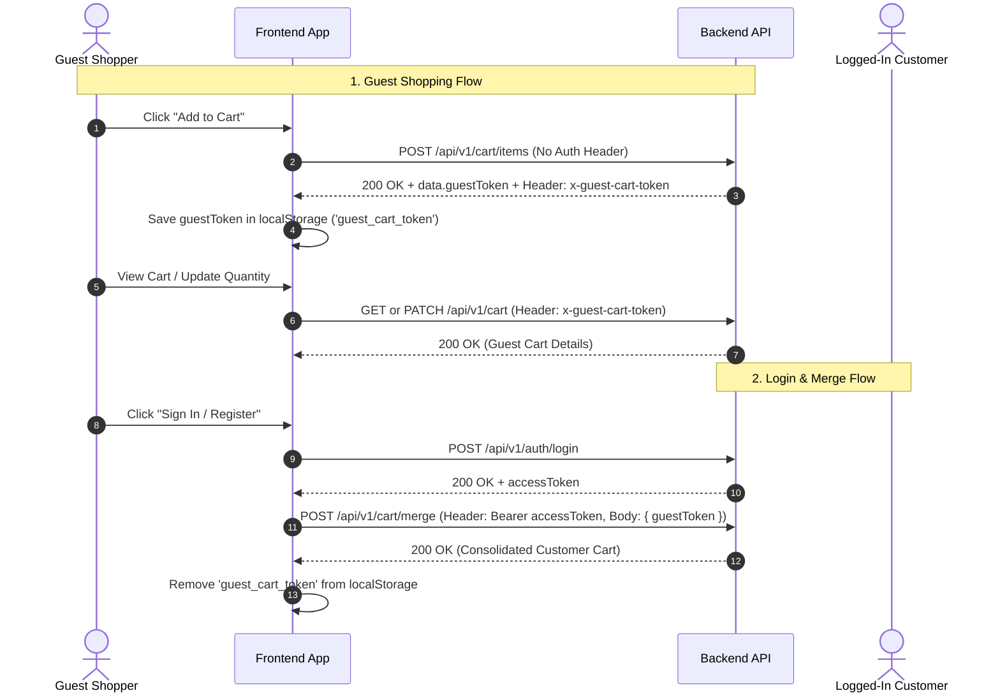

# Cart API Documentation (Frontend Integration Guide)

This documentation provides frontend developers with a complete, practical guide to integrating the **Cart Domain** into web and mobile storefronts (Next.js, React, Vue, React Native, iOS, Android).

---

## 1. Base URL & Route Aliases

- **Localhost**: `http://localhost:5000/api/v1` *(also supports `/api`)*
- **Production (Render)**: `https://dress-ecomm-backend.onrender.com/api/v1` *(also supports `/api`)*

### Supported Route Aliases
The backend supports both singular (`/cart`) and plural RESTful (`/carts`) routes:
- `/cart` $\leftrightarrow$ `/carts`
- `/cart/items` $\leftrightarrow$ `/carts/items` or `/carts/:cartId/items`
- `/cart/metafields` $\leftrightarrow$ `/carts/:cartId/metafields`

> **Frontend Recommendation**: Use `/api/v1/cart` for standard session-based carts. You don't need to manually pass `:cartId` in URLs—the backend resolves the active cart automatically via your authentication token or guest header!

---

## 2. Authentication & Guest Token Workflow

The cart system provides a seamless experience for both **Guests (unauthenticated)** and **Customers (authenticated)**.



### A. Guest Users (No Login Required)
1. Guests do **not** need an account to add items to cart, change quantities, add modifiers, or attach metafields.
2. On the first item added (or when calling `POST /cart`), the backend generates a secure `guestToken` (UUID).
3. The backend returns this token in two places:
   - Response JSON: `data.guestToken`
   - Response Header: `x-guest-cart-token`
4. **Frontend Action**: Store this token in `localStorage` or a cookie:
   ```javascript
   localStorage.setItem('guest_cart_token', res.data.guestToken);
   ```
5. On all subsequent requests, pass the header:
   ```http
   x-guest-cart-token: <saved_guest_token>
   ```
   *(The backend also accepts `x-cart-token` or query param `?guestToken=...`)*.

---

### B. Authenticated Customers
1. Send the standard Bearer token:
   ```http
   Authorization: Bearer <accessToken>
   ```
2. The backend automatically resolves the customer's persistent active cart.
3. The customer's cart persists across browser sessions, devices, and logins.

---

### C. Guest $\to$ Customer Cart Merge (After Login/Registration)
When a guest customer logs in or creates an account:
1. Retrieve the saved `guest_cart_token` from `localStorage`.
2. If a guest token exists, call the merge endpoint:
   ```http
   POST /api/v1/cart/merge
   Authorization: Bearer <accessToken>
   Content-Type: application/json

   {
     "guestToken": "your_saved_guest_token_uuid"
   }
   ```
3. **What the Backend Does Automatically**:
   - Matches identical items (same product + variant + modifiers) and combines their quantities up to available stock.
   - Preserves items with different configurations as distinct line items.
   - Copies guest cart-level metafields to the customer's cart.
   - Deactivates the guest cart (`status: "CONVERTED"`).
   - Returns the updated, merged customer cart.
4. **Frontend Action**: Remove the `guest_cart_token` from `localStorage` once merged.

---

## 3. Quick Summary of Endpoints

| Method | Endpoint | Description | Auth Required |
| :--- | :--- | :--- | :--- |
| `GET` | `/cart` | Get current active cart with full pricing & stock | Optional (Guest or Customer) |
| `POST` | `/cart` | Explicitly initialize or retrieve cart | Optional (Guest or Customer) |
| `POST` | `/cart/items` | Add product + variant + modifiers to cart | Optional (Guest or Customer) |
| `PATCH` | `/cart/items/:itemId` | Update quantity or modifiers for a cart item | Optional (Guest or Customer) |
| `DELETE`| `/cart/items/:itemId` | Remove a single item from cart | Optional (Guest or Customer) |
| `DELETE`| `/cart/items` | Clear all items from cart | Optional (Guest or Customer) |
| `POST` | `/cart/merge` | Merge guest cart into customer cart after login | **Required** (Customer JWT) |
| `GET` | `/cart/metafields` | List cart-level metafields (e.g. gift notes) | Optional (Guest or Customer) |
| `POST` | `/cart/metafields` | Create or update (upsert) a cart metafield | Optional (Guest or Customer) |
| `PATCH` | `/cart/metafields/:metafieldId` | Update a cart metafield | Optional (Guest or Customer) |
| `DELETE`| `/cart/metafields/:metafieldId` | Delete a cart metafield | Optional (Guest or Customer) |
| `GET` | `/cart/items/:itemId/metafields` | List item-level metafields (e.g. engraving) | Optional (Guest or Customer) |
| `POST` | `/cart/items/:itemId/metafields` | Create or update an item-level metafield | Optional (Guest or Customer) |
| `PATCH` | `/cart/items/:itemId/metafields/:metafieldId` | Update an item-level metafield | Optional (Guest or Customer) |
| `DELETE`| `/cart/items/:itemId/metafields/:metafieldId` | Delete an item-level metafield | Optional (Guest or Customer) |

---

## 4. Core Concepts for the Frontend Team

### A. Cart Totals & Item Badges
Every cart response calculates frontend-ready financial totals:

```json
{
  "itemCount": 4,
  "lineItemCount": 3,
  "subtotal": 17299,
  "modifiersTotal": 450,
  "discounts": [],
  "shipping": null,
  "tax": null,
  "total": 17749
}
```

- **Navbar Cart Badge**: Always display `itemCount` (sum of all quantities). E.g., 2 shirts + 2 gowns = `4`.
- **Unique Item Rows**: Use `lineItemCount` for how many rows exist in the table.
- **Modifiers Total**: Total cost of all selected add-ons across the entire cart.
- **Grand Total**: `total` equals `subtotal + modifiersTotal`.
- **Extensibility**: `discounts`, `shipping`, and `tax` are clean null/empty placeholders ready for future coupon, shipping, and tax engines without breaking your UI.

---

### B. Live Stock & Availability Status
When the cart is fetched, the backend revalidates inventory against current stock in real time:

```json
"availability": {
  "status": "AVAILABLE",
  "availableQuantity": 15
}
```

| Status | Meaning | Recommended Frontend UI Behavior |
| :--- | :--- | :--- |
| `AVAILABLE` | Requested quantity is fully available in stock. | Normal state. Allow proceeding to checkout. |
| `INSUFFICIENT_STOCK` | Store has fewer items than requested (e.g., requested 5, but stock is 2). | Show warning banner: *"Only 2 items left in stock."* Restrict quantity selector to `availableQuantity`. |
| `OUT_OF_STOCK` | Product or variant has 0 stock or was disabled by store admin. | **Do NOT delete the item!** Display a red badge: *"Currently Out of Stock"*. Disable checkout until resolved or item is removed. |

---

### C. Configuration Uniqueness & Add-to-Cart Behavior
A cart item represents a unique purchasable configuration:
$$\text{Configuration} = \text{Product} + \text{Selected Variant} + \text{Selected Modifiers}$$

1. **Adding Same Configuration**:
   - If a customer adds *Emerald Silk Gown (Size: S, Luxury Box)*, and then adds *Emerald Silk Gown (Size: S, Luxury Box)* again:
   - The backend **increments the existing item's quantity** ($1 + 1 = 2$). It does *not* create duplicate rows.
2. **Adding Different Configurations**:
   - *Emerald Silk Gown (Size: S)* vs *Emerald Silk Gown (Size: M)* $\to$ 2 separate lines.
   - *Emerald Silk Gown (Size: S, Standard Bag)* vs *Emerald Silk Gown (Size: S, Luxury Box)* $\to$ 2 separate lines.

---

### D. Authoritative 3-Tier Price Snapshots
Each cart item returns an authoritative price breakdown:
```json
"pricing": {
  "unitPrice": 8499,
  "regularPrice": 12500,
  "salePrice": 9999,
  "offerPrice": 8499,
  "modifierTotal": 450,
  "lineTotal": 8949
}
```
- `unitPrice`: The effective price of the product/variant alone.
- `modifierTotal`: Sum of selected modifier options for this unit.
- `lineTotal`: `(unitPrice + modifierTotal) * quantity`.
- Money is calculated server-side using PostgreSQL Decimals to prevent floating-point rounding errors.

---

### E. Metafields (Custom Business Data)
Metafields let the frontend attach arbitrary custom data to a cart or individual cart item without database schema changes:

- **Cart-Level Metafield Examples**:
  - `namespace: "checkout"`, `key: "gift_message"`, `value: "Happy Birthday Sis!"`
  - `namespace: "delivery"`, `key: "instructions"`, `value: "Leave package at front gate"`
  - `namespace: "marketing"`, `key: "campaign_source"`, `value: "INSTA_SPRING_2026"`
- **Item-Level Metafield Examples**:
  - `namespace: "customization"`, `key: "engraving"`, `value: "A & M 2026"`
  - `namespace: "measurements"`, `key: "sleeve_length"`, `value: "34.5"`
- Supported `valueType`s: `"STRING"`, `"NUMBER"`, `"BOOLEAN"`, `"JSON"`.

---

## 5. Endpoints in Detail

### 1) Get Active Cart
Retrieves the user's active cart. If an unauthenticated guest has no cart yet, it returns a clean empty cart structure.

- **Method**: `GET`
- **URL**: `/api/v1/cart`
- **Headers**:
  - Guest: `x-guest-cart-token: <token>` *(optional for first view)*
  - Customer: `Authorization: Bearer <accessToken>`

#### Success Response (`200 OK`)
```json
{
  "success": true,
  "message": "Cart retrieved successfully",
  "data": {
    "id": "33eabae5-7161-45e6-8cc1-4b2e0effaaa6",
    "guestToken": "ec40c06d-d5e1-40eb-bbd6-51efe5fe76cf",
    "customerId": null,
    "status": "ACTIVE",
    "currency": "INR",
    "itemCount": 2,
    "lineItemCount": 1,
    "subtotal": 16998,
    "modifiersTotal": 900,
    "discounts": [],
    "shipping": null,
    "tax": null,
    "total": 17898,
    "items": [
      {
        "id": "7fa69f3a-9e12-4217-a021-39c28e932ff4",
        "productId": "04de36fe-1b09-4c27-a793-5bf9c9ff0412",
        "variantId": "91547e56-5e37-49dd-904b-1623fd86e128",
        "quantity": 2,
        "product": {
          "id": "04de36fe-1b09-4c27-a793-5bf9c9ff0412",
          "name": "Elysian Emerald Silk Evening Gown",
          "slug": "elysian-emerald-silk-evening-gown",
          "brand": "Maison Éléganz",
          "sku": "MDE-EVE-001",
          "thumbnail": "https://images.unsplash.com/photo-1566174053879-31528523f8ae?auto=format&fit=crop&w=800&q=80"
        },
        "variant": {
          "id": "91547e56-5e37-49dd-904b-1623fd86e128",
          "sku": "MDE-EVE-001-S",
          "name": "Emerald Silk Gown - Size S",
          "attributes": [
            {
              "attribute": "Size",
              "attributeSlug": "size",
              "value": "S",
              "valueSlug": "s"
            },
            {
              "attribute": "Color",
              "attributeSlug": "color",
              "value": "Emerald Green",
              "valueSlug": "emerald-green"
            }
          ]
        },
        "selectedModifiers": [
          {
            "id": "a14d0059-9d8d-4d75-bf4c-2261c032abcc",
            "name": "Velvet Signature Keepsake Box",
            "groupName": "Luxury Gift Box",
            "priceDelta": 450
          }
        ],
        "pricing": {
          "unitPrice": 8499,
          "regularPrice": 12500,
          "salePrice": 9999,
          "offerPrice": 8499,
          "modifierTotal": 450,
          "lineTotal": 17898
        },
        "availability": {
          "status": "AVAILABLE",
          "availableQuantity": 15
        },
        "metafields": []
      }
    ],
    "metafields": [],
    "createdAt": "2026-10-04T13:59:58.253Z",
    "updatedAt": "2026-10-04T14:15:20.120Z"
  }
}
```

---

### 2) Add Item to Cart
Adds a product to the cart with optional variant and modifiers.

- **Method**: `POST`
- **URL**: `/api/v1/cart/items`
- **Headers**:
  - `Content-Type: application/json`
  - Guest: `x-guest-cart-token: <token>` *(optional on first add)*
  - Customer: `Authorization: Bearer <accessToken>`

#### Request Body
```json
{
  "productId": "04de36fe-1b09-4c27-a793-5bf9c9ff0412",
  "variantId": "91547e56-5e37-49dd-904b-1623fd86e128",
  "quantity": 1,
  "modifierOptionIds": [
    "a14d0059-9d8d-4d75-bf4c-2261c032abcc"
  ],
  "metafields": [
    {
      "namespace": "customization",
      "key": "monogram",
      "value": "J.M.",
      "valueType": "STRING"
    }
  ]
}
```

| Field | Type | Required? | Description |
| :--- | :--- | :--- | :--- |
| `productId` | `string (UUID)` | **Yes** | Product ID |
| `variantId` | `string (UUID)` | Conditional | Required if the product has variants (`hasVariants: true`). Must be omitted/null if product has no variants. |
| `quantity` | `integer` | No *(Default: 1)* | Positive integer between 1 and 999. |
| `modifierOptionIds` | `string[] (UUIDs)` | No *(Default: [])* | Array of selected `ModifierOption` IDs. |
| `metafields` | `array` | No | Initial item-level metafields. |

#### Success Response (`200 OK`)
Returns the complete updated cart object. The response headers will include `x-guest-cart-token` if you are a guest.

#### Common Error Responses
- `400 Bad Request` (`code: "VARIANT_REQUIRED"`): Product has variants, but no `variantId` was sent.
- `400 Bad Request` (`code: "INVALID_VARIANT"`): `variantId` does not belong to this product.
- `400 Bad Request` (`code: "INVALID_MODIFIER"`): Modifier option does not belong to this product.
- `400 Bad Request` (`code: "OUT_OF_STOCK"`): Product or variant currently has 0 stock.
- `400 Bad Request` (`code: "INSUFFICIENT_STOCK"`): Requested quantity exceeds available stock.

---

### 3) Update Cart Item Quantity or Modifiers
Change the quantity of an item or update its modifier options.

- **Method**: `PATCH`
- **URL**: `/api/v1/cart/items/:itemId`
- **Headers**:
  - Guest: `x-guest-cart-token: <token>`
  - Customer: `Authorization: Bearer <accessToken>`

#### Request Body (Change Quantity)
```json
{
  "quantity": 3
}
```

#### Request Body (Change Modifiers)
```json
{
  "modifierOptionIds": [
    "6afab7e7-0e3a-48ff-9558-e45d50f447f1"
  ]
}
```

#### Success Response (`200 OK`)
Returns the updated cart object with recalculated totals and line totals.

---

### 4) Remove Item from Cart
Deletes an item row from the cart.

- **Method**: `DELETE`
- **URL**: `/api/v1/cart/items/:itemId`
- **Headers**: Guest or Customer auth headers.

#### Success Response (`200 OK`)
Returns the updated cart object without the deleted item.

---

### 5) Clear Entire Cart
Removes all items from the cart in a single transaction.

- **Method**: `DELETE`
- **URL**: `/api/v1/cart/items`
- **Headers**: Guest or Customer auth headers.

#### Success Response (`200 OK`)
Returns the empty cart object (`itemCount: 0`, `items: []`, `total: 0`).

---

### 6) Merge Guest Cart into Customer Cart
Call this endpoint immediately after a customer logs in or completes registration if they had items in their guest cart.

- **Method**: `POST`
- **URL**: `/api/v1/cart/merge`
- **Headers**:
  - `Authorization: Bearer <accessToken>` **(Required)**
  - `Content-Type: application/json`

#### Request Body
```json
{
  "guestToken": "ec40c06d-d5e1-40eb-bbd6-51efe5fe76cf"
}
```

#### Success Response (`200 OK`)
```json
{
  "success": true,
  "message": "Guest cart merged successfully into customer cart",
  "data": {
    "id": "customer-cart-uuid",
    "customerId": "user-uuid",
    "itemCount": 4,
    "items": [ ... ],
    "total": 24299
  }
}
```

---

### 7) Cart Metafields Endpoints

#### List Cart Metafields
- **Method**: `GET`
- **URL**: `/api/v1/cart/metafields`

#### Create or Upsert Cart Metafield
- **Method**: `POST`
- **URL**: `/api/v1/cart/metafields`
- **Body**:
```json
{
  "namespace": "checkout",
  "key": "gift_message",
  "value": "Happy Birthday to you!",
  "valueType": "STRING"
}
```
*Note: `valueType` can be `"STRING"`, `"NUMBER"`, `"BOOLEAN"`, or `"JSON"`.*

#### Update Cart Metafield
- **Method**: `PATCH`
- **URL**: `/api/v1/cart/metafields/:metafieldId`
- **Body**:
```json
{
  "value": "New message content"
}
```

#### Delete Cart Metafield
- **Method**: `DELETE`
- **URL**: `/api/v1/cart/metafields/:metafieldId`

---

### 8) Cart Item Metafields Endpoints

#### List Item Metafields
- **Method**: `GET`
- **URL**: `/api/v1/cart/items/:itemId/metafields`

#### Create or Upsert Item Metafield
- **Method**: `POST`
- **URL**: `/api/v1/cart/items/:itemId/metafields`
- **Body**:
```json
{
  "namespace": "customization",
  "key": "engraving_text",
  "value": "Elegance 2026",
  "valueType": "STRING"
}
```

#### Delete Item Metafield
- **Method**: `DELETE`
- **URL**: `/api/v1/cart/items/:itemId/metafields/:metafieldId`

---

## 6. Frontend TypeScript Interfaces & Integration Snippet

### TypeScript Type Definitions
```typescript
export type MetafieldValueType = 'STRING' | 'NUMBER' | 'BOOLEAN' | 'JSON';
export type AvailabilityStatus = 'AVAILABLE' | 'OUT_OF_STOCK' | 'INSUFFICIENT_STOCK';

export interface CartMetafield {
  id: string;
  namespace: string;
  key: string;
  value: string;
  valueType: MetafieldValueType;
}

export interface SelectedModifier {
  id: string;
  name: string;
  groupName: string;
  priceDelta: number;
}

export interface CartItem {
  id: string;
  productId: string;
  variantId: string | null;
  quantity: number;
  product: {
    id: string;
    name: string;
    slug: string;
    brand: string | null;
    sku: string | null;
    thumbnail: string | null;
  };
  variant: {
    id: string;
    sku: string;
    name: string | null;
    attributes: Array<{
      attribute: string;
      attributeSlug: string;
      value: string;
      valueSlug: string;
    }>;
  } | null;
  selectedModifiers: SelectedModifier[];
  pricing: {
    unitPrice: number;
    regularPrice: number;
    salePrice: number | null;
    offerPrice: number | null;
    modifierTotal: number;
    lineTotal: number;
  };
  availability: {
    status: AvailabilityStatus;
    availableQuantity: number;
  };
  metafields: CartMetafield[];
}

export interface Cart {
  id: string | null;
  guestToken: string | null;
  customerId: string | null;
  status: 'ACTIVE' | 'CONVERTED' | 'ABANDONED' | 'EXPIRED';
  currency: string;
  itemCount: number;
  lineItemCount: number;
  subtotal: number;
  modifiersTotal: number;
  discounts: any[];
  shipping: number | null;
  tax: number | null;
  total: number;
  items: CartItem[];
  metafields: CartMetafield[];
}
```

---

### React / Next.js API Client Helper (`apiClient.ts`)
```typescript
const BASE_URL = process.env.NEXT_PUBLIC_API_URL || 'http://localhost:5000/api/v1';

export async function cartApiFetch(endpoint: string, options: RequestInit = {}) {
  const headers: Record<string, string> = {
    'Content-Type': 'application/json',
    ...(options.headers as Record<string, string>),
  };

  // 1. Attach Customer JWT if logged in
  const token = typeof window !== 'undefined' ? localStorage.getItem('access_token') : null;
  if (token) {
    headers['Authorization'] = `Bearer ${token}`;
  } else if (typeof window !== 'undefined') {
    // 2. Otherwise attach Guest Cart Token if present
    const guestToken = localStorage.getItem('guest_cart_token');
    if (guestToken) {
      headers['x-guest-cart-token'] = guestToken;
    }
  }

  const response = await fetch(`${BASE_URL}${endpoint}`, {
    ...options,
    headers,
  });

  // Automatically capture and store guest cart token from response header or payload
  const returnedGuestToken = response.headers.get('x-guest-cart-token');
  if (returnedGuestToken && typeof window !== 'undefined') {
    localStorage.setItem('guest_cart_token', returnedGuestToken);
  }

  const result = await response.json();
  if (result?.data?.guestToken && typeof window !== 'undefined') {
    localStorage.setItem('guest_cart_token', result.data.guestToken);
  }

  return { ok: response.ok, status: response.status, ...result };
}
```

---

### Login Handler with Automatic Cart Merge
```typescript
export async function handleLoginSuccess(authResponse: { user: any; accessToken: string }) {
  // 1. Save access token
  localStorage.setItem('access_token', authResponse.accessToken);

  // 2. Check if user had a guest cart
  const guestToken = localStorage.getItem('guest_cart_token');
  if (guestToken) {
    try {
      const mergeRes = await cartApiFetch('/cart/merge', {
        method: 'POST',
        body: JSON.stringify({ guestToken }),
      });

      if (mergeRes.ok) {
        console.log('Cart merged successfully!', mergeRes.data);
        // Clear guest token as cart is now attached to customer account
        localStorage.removeItem('guest_cart_token');
      }
    } catch (err) {
      console.error('Failed to merge guest cart:', err);
    }
  }
}
```

---

## 7. What Was Added & Updated in the Backend

For developer visibility, here is a summary of the backend components implemented:

1. **Prisma Multi-Schema Migration**:
   - Added [`prisma/schema/cart.prisma`](file:///Users/jegannathan.m/Projects/dress-ecomm-backend/prisma/schema/cart.prisma) with models `Cart`, `CartItem`, `CartItemModifier`, `CartMetafield`, `CartItemMetafield`, and enums `CartStatus`, `MetafieldValueType`.
   - Updated [`auth.prisma`](file:///Users/jegannathan.m/Projects/dress-ecomm-backend/prisma/schema/auth.prisma) with `User.carts`.
   - Updated [`catalog.prisma`](file:///Users/jegannathan.m/Projects/dress-ecomm-backend/prisma/schema/catalog.prisma) with `Product.cartItems`, `ProductVariant.cartItems`, and `ModifierOption.cartItemModifiers`.
   - Safe migration pushed to Neon PostgreSQL (no tables dropped, no data deleted).
2. **Domain Constants** ([`src/constants/cart.constants.js`](file:///Users/jegannathan.m/Projects/dress-ecomm-backend/src/constants/cart.constants.js)):
   - `CART_STATUS`, `AVAILABILITY_STATUS`, `METAFIELD_VALUE_TYPE`, `CART_HEADERS`, `CART_LIMITS`.
3. **Zod Validation Middleware** ([`src/validators/cart.validator.js`](file:///Users/jegannathan.m/Projects/dress-ecomm-backend/src/validators/cart.validator.js)):
   - Input validation for add item, update item, merge, and metafields with type checking (`STRING`, `NUMBER`, `BOOLEAN`, `JSON`).
4. **Service Layer** ([`src/services/client/cart.service.js`](file:///Users/jegannathan.m/Projects/dress-ecomm-backend/src/services/client/cart.service.js)):
   - Built exclusively with clean, pure functions (no classes).
   - Deterministic SHA-256 configuration signature hashing (`generateConfigHash`).
   - Transaction-safe item addition and guest-to-customer merging.
   - Authoritative financial pricing snapshots with Decimal safety.
   - Real-time stock validation and availability state resolution.
   - Optimized queries with relation inclusions to eliminate N+1 overhead.
5. **Controller Layer** ([`src/controllers/client/cart.controller.js`](file:///Users/jegannathan.m/Projects/dress-ecomm-backend/src/controllers/client/cart.controller.js)):
   - Functional Express request handlers with automatic `x-guest-cart-token` response header injection.
6. **Routes** ([`src/routes/client/cart.routes.js`](file:///Users/jegannathan.m/Projects/dress-ecomm-backend/src/routes/client/cart.routes.js)):
   - Mounted at `/api/v1/cart` and `/api/v1/carts` in [`src/routes/index.js`](file:///Users/jegannathan.m/Projects/dress-ecomm-backend/src/routes/index.js).
